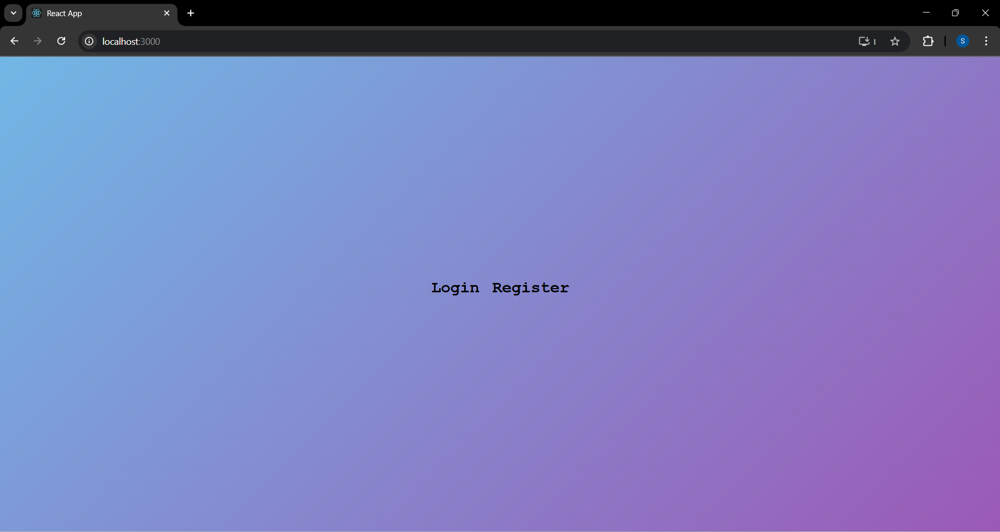
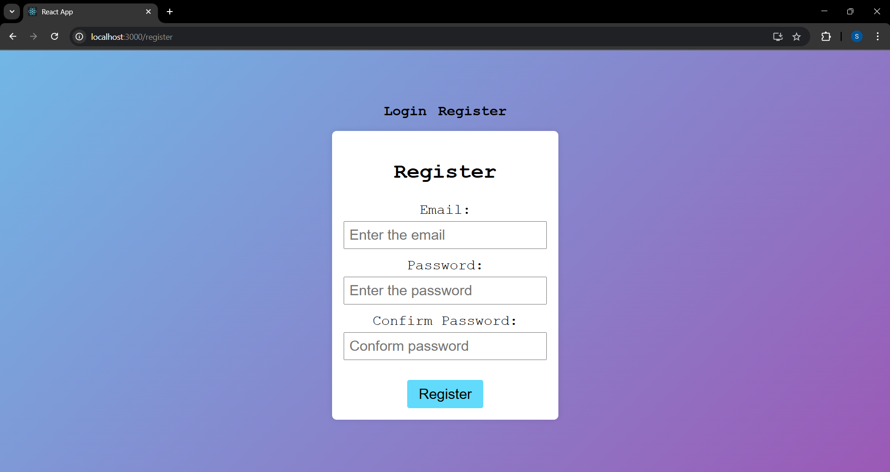
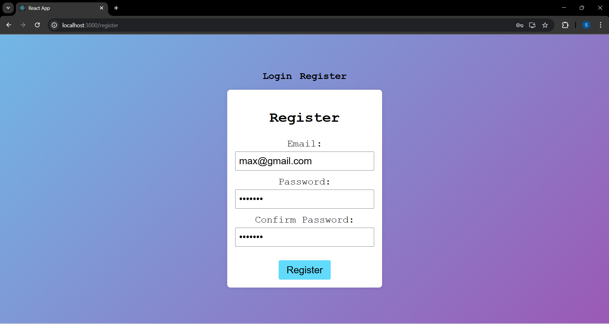
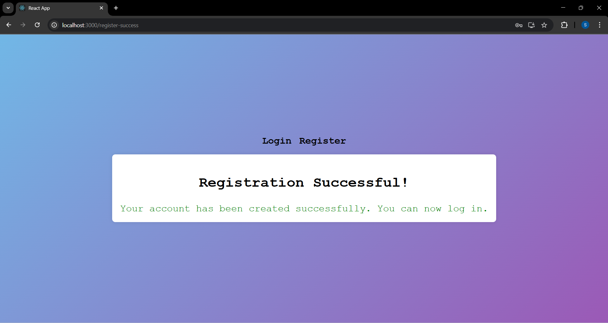
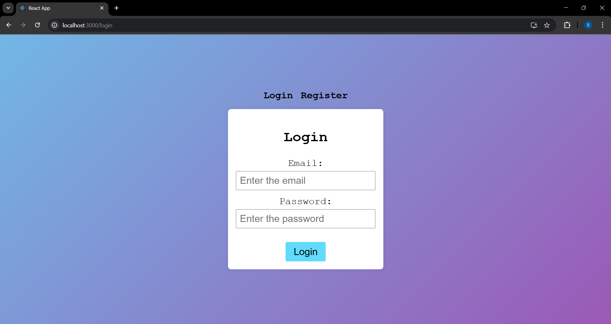
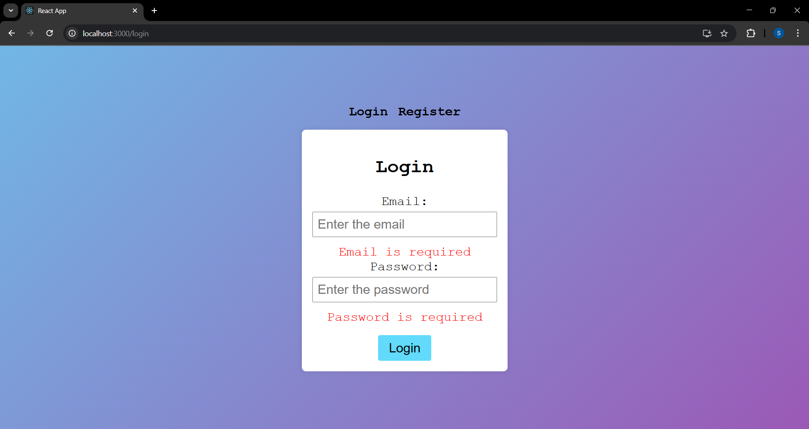
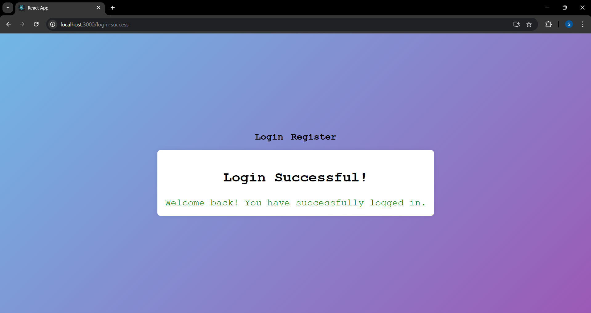

# 🔐 Simple Login & Register System

A clean and modern **Login/Register** interface built using **React.js**. This project showcases basic authentication UI features with responsive design and smooth transitions — perfect for learning or integrating into your larger apps.

---

## ✨ Features

- 🔒 Secure Login & Registration Forms
- 🎨 Modern and responsive UI
- 🔁 Smooth navigation between login and register
- ✅ Real-time form validation
- ⚛️ Built using React functional components and hooks

---

## 📸 Output

### 🏠 Home Page

---

### 📝 Register Page

 

 

---

### 🔑 Login Page

 

 

